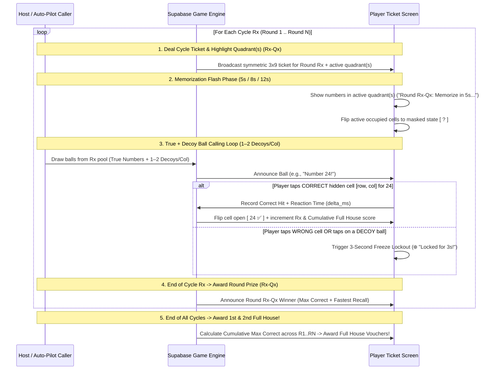

# DabHousie Next-Gen Platform Plan: Bingo5 / Bingo10 / Bingo15 (Multi-Cycle Skill-Memory Mode) & Multi-Variant Engine

**Document Version:** 3.0  
**Date:** September 26, 2026  
**Prepared For:** Digital App Studio — Architecture & Product Review  
**Status:** Updated with Multi-Cycle Round Prizes (`Rx-Qx`) & Cumulative Full House Grand Prize Specification  

---

## 1. Executive Summary & Strategic Breakthrough

Traditional Trivia/Quiz games require maintaining large, language-specific question banks. By contrast, **Digital App Studio's proprietary Quadrant Memory-Speed Bingo (`Bingo5`, `Bingo10`, `Bingo15`)** transforms the classic $3 \times 9$ Tambola grid into a **100% Pure-Skill, Zero-Question-Bank Multiplayer Game**:

1. **Zero Luck (Symmetric Competition):** Every player in the room receives the **exact same ticket matrix** in every round. Victory depends strictly on **Visual Working Memory + Spatial Column Recall + Reaction Speed**.
2. **Multi-Cycle Event Structure (`Rx-Qx` Round Prizes + Cumulative Full House):** A single quadrant sprint takes ~90 seconds, so the **Host selects the number of Cycles/Rounds (e.g., 3, 4, 5, or 6 Rounds)** to form a complete 10–20 minute party event. Each Round awards a **Round Winner (`Rx-Qx` Minor Prize)**, while **1st & 2nd Full House (Grand Prizes)** are awarded to the players with the **Maximum Cumulative Correct Numbers across all Rounds**.
3. **95% Codebase Reuse:** Reuses the existing $3 \times 9$ [`TambolaTicketHelper`](file:///c:/dev/Tambola/lib/core/utils/tambola_ticket.dart), [`PlayerTicketScreen`](file:///c:/dev/Tambola/lib/features/gameplay/screens/player_ticket_screen.dart), [`AdminGameControlScreen`](file:///c:/dev/Tambola/lib/features/gameplay/screens/admin_game_control_screen.dart), [`LiveGameDisplayScreen`](file:///c:/dev/Tambola/lib/features/live_display/screens/live_game_display_screen.dart), and Brand Partner Voucher fulfillment pipeline.

---

## 2. Flagship Skill Mode: Quadrant Memory-Speed Bingo (`Bingo5` / `Bingo10` / `Bingo15`)

### 2.1 How the $3 \times 9$ Ticket Splits into 3 Quadrants
A standard $3 \times 9$ Tambola ticket has **9 columns** and **15 numbers** (5 per row). Vertically, it divides naturally into **three $3 \times 3$ Quadrants**, each containing **5 numbers** in standard mode (or **9 numbers** in the Full-Quadrant variant):

- **Quadrant 1 (`Q1` — Columns 1–3):** Number range `1–30` (`Col 1: 1–10`, `Col 2: 11–20`, `Col 3: 21–30`)
- **Quadrant 2 (`Q2` — Columns 4–6):** Number range `31–60` (`Col 4: 31–40`, `Col 5: 41–50`, `Col 6: 51–60`)
- **Quadrant 3 (`Q3` — Columns 7–9):** Number range `61–90` (`Col 7: 61–70`, `Col 8: 71–80`, `Col 9: 81–90`)

### 2.2 Per-Cycle Mode Breakdown (`Bingo5`, `Bingo10`, `Bingo15`)

| Game Mode | Active Quadrants per Cycle | Occupied Cells per Cycle (Standard vs. Full Variant) | Caller Ball Pool per Cycle (`True` + `1–2 Decoys/Col`) | Memory Flash Window | Duration per Cycle |
| :--- | :--- | :--- | :--- | :--- | :--- |
| **Bingo5** *(1 Quadrant / Cycle)* | **1 Quadrant** (`Q1`, `Q2`, *or* `Q3`) | **5 of 9 cells** *(or **9 of 9 cells** in Full mode)* | **8–9 balls** (`5` true + `3–4` decoys)<br>*(Full mode: `9` true + `3–5` decoys = `12–14` balls)* | **5 sec** *(8s for 9-cell)* | **~1.5 mins** |
| **Bingo10** *(2 Quadrants / Cycle)* | **2 Quadrants** (`Q1+Q2`, `Q1+Q3`, *or* `Q2+Q3`) | **10 of 18 cells** ($5+5$)<br>*(or **18 of 18 cells** in Full mode)* | **16–18 balls** (`10` true + `6–8` decoys) | **8 sec** | **~3 mins** |
| **Bingo15** *(All 3 Quadrants / Cycle)* | **All 3 Quadrants** (`Q1 + Q2 + Q3`) | **15 of 27 cells** ($5+5+5$)<br>*(or **27 of 27 cells** in Full mode)* | **24–27 balls** (`15` true + `9–12` decoys) | **12 sec** | **~5 mins** |

---

### 2.3 Multi-Cycle Prize Architecture: Round Prizes (`Rx-Qx`) + Grand Prizes (`Full House`)

In classic 90-Ball Tambola, a game has **Minor Prizes** (*Early 5, Top Line, Middle Line, Bottom Line, Four Corners*) and **Grand Prizes** (*1st Full House, 2nd Full House*).  
In `Bingo5 / Bingo10 / Bingo15`, the **Host selects the number of Cycles/Rounds $R$** (e.g., **3 Rounds**, **4 Rounds**, **5 Rounds**, or **6 Rounds**) during game setup, and the prizes map directly to our existing voucher budget engine:

#### A. Minor Prizes = Round-Level Winners (`R1-Qx`, `R2-Qy`, ..., `Rn-Qz`)
- Each cycle $x \in \{1 \dots R\}$ randomly activates its quadrant(s) — for example in a **3-Cycle `Bingo5` game**:
  - **Round 1 (`R1-Q2`):** Quadrant 2 (`31–60`) is flashed and played $\rightarrow$ Awards **Round 1 (`R1-Q2`) Voucher Prize**.
  - **Round 2 (`R2-Q1`):** Fresh ticket, Quadrant 1 (`1–30`) is flashed and played $\rightarrow$ Awards **Round 2 (`R2-Q1`) Voucher Prize**.
  - **Round 3 (`R3-Q3`):** Fresh ticket, Quadrant 3 (`61–90`) is flashed and played $\rightarrow$ Awards **Round 3 (`R3-Q3`) Voucher Prize**.
- **How a Round Winner (`Rx-Qx`) Is Determined:**
  1. **Primary Metric — Maximum Correct Recalls in Round $x$** (e.g., `5/5` in standard `Bingo5`, or `9/9` in full-quadrant `Bingo5`).
  2. **First Tie-Breaker — Fewest Wrong/Decoy Taps** in Round $x$.
  3. **Millisecond Tie-Breaker — Lowest Cumulative Reaction Time ($\sum \Delta t_{\text{ms}}$)** across the correct taps in Round $x$ (or most "1st-to-Click" balls won in that round).
- **Spreading Winners Across Rounds (Minor Prize Policy):**
  - Just like our existing [`CreateGameScreen`](file:///c:/dev/Tambola/lib/features/game_setup/screens/create_game_screen.dart) policy (`ONE_MINOR_PER_PLAYER`), if the host selects **"Max 1 Round Prize per Player + Full House"**, a player who already won `R1-Q2` remains 100% eligible for **1st/2nd Full House**, while the `R2-Q1` Round Prize goes to the top player who hasn't won a Round Prize yet!

#### B. Grand Prizes = Overall Multi-Cycle Champions (`1st Full House` & `2nd Full House`)
- **🏆 1st Full House (Grand Champion — Open to ALL Players):**
  - Awarded at the end of the final Cycle ($R_{\text{final}}$) to the player with the **Maximum Cumulative Correct Numbers across ALL Rounds combined**:
    $$\text{Total Correct} = \sum_{x=1}^{R} \text{Correct}_x \quad \text{(e.g., out of } 5 \times 3 = 15 \text{ in a 3-Cycle Bingo5 game)}$$
  - Tie-breaker: Fewest total wrong taps $\rightarrow$ Lowest cumulative reaction time ($\sum \Delta t_{\text{ms}}$) across all rounds.
- **🥈 2nd Full House (Runner-Up Grand Prize — Open to ALL Except 1st Full House Winner):**
  - Awarded to the player with the **2nd Highest Cumulative Correct Numbers** across all rounds.
- **Why This Preserves the DabHousie "Golden Rule" (Zero Early Drop-Off):**
  - Even if a player misses 1 number in Round 1 and loses the `R1` prize, getting `4/5` in Round 1 + `5/5` in Round 2 + `5/5` in Round 3 (`14/15` total) keeps them in prime contention to win **1st or 2nd Full House**! Every single ball in every single round matters until the very last call of the final cycle.

---

### 2.4 Gameplay Loop & Anti-Cheat Mechanics



---

## 3. Seamless Mapping to Existing `CreateGameScreen` & Voucher System

Because `Rx-Qx` Round Prizes and `Full House` Grand Prizes mirror standard Tambola's Minor + Grand prize structure, your existing **Promotional Voucher Budget, Auto-Split, and Brand Partner Gift Picker** in [`CreateGameScreen`](file:///c:/dev/Tambola/lib/features/game_setup/screens/create_game_screen.dart) work out-of-the-box:

| Standard 90-Ball Prize Key | Multi-Cycle Memory Mode Equivalent (Example: 4 Cycles) | Eligibility Rule |
| :--- | :--- | :--- |
| `ROUND_1` *(replaces Early 5)* | **Round 1 Winner (`R1-Qx` Max Correct)** | Minor Prize Policy applies |
| `ROUND_2` *(replaces Top Line)* | **Round 2 Winner (`R2-Qx` Max Correct)** | Minor Prize Policy applies |
| `ROUND_3` *(replaces Middle Line)* | **Round 3 Winner (`R3-Qx` Max Correct)** | Minor Prize Policy applies |
| `ROUND_4` *(replaces Bottom Line)* | **Round 4 Winner (`R4-Qx` Max Correct)** | Minor Prize Policy applies |
| `FULL_HOUSE` | **🏆 1st Full House (Max Correct Across All Rounds)** | **🔓 Open to ALL Players** |
| `SECOND_FULL_HOUSE` | **🥈 2nd Full House (2nd Max Correct Across All Rounds)** | **🔓 Open to ALL Except 1st FH** |

---

## 4. Phase 2: Multi-Variant Classic Bingo Engine (75, 80, 36, 30-Ball)

Alongside `Bingo5 / Bingo10 / Bingo15` Memory Mode, hosts can choose classic luck-based regional Bingo variants:

| Variant Code | Display Name | Grid Layout | Ball Range | Default Prize Patterns |
| :--- | :--- | :--- | :--- | :--- |
| `BINGO_90` | **90-Ball Tambola / Housie** | $3 \times 9$ (15 nums, 12 blanks) | `1–90` | Early 5, Top/Mid/Bot Line, 4 Corners, 1st & 2nd Full House |
| `BINGO_75` | **75-Ball American Bingo** | $5 \times 5$ (24 nums + center `FREE`) | `1–75` (`B-I-N-G-O`) | Any 1 Line (H/V/Diag), 4 Corners, X-Pattern, Blackout |
| `BINGO_80` | **80-Ball Arcade Bingo** | $4 \times 4$ (16 nums, 4 color cols) | `1–80` | Any 1 Line, 4 Corners, Center 4-Square, 2 Lines, Full House |
| `BINGO_30` | **30-Ball Speed Bingo** | $3 \times 3$ (9 nums, no blanks) | `1–30` | 1st Line, Full House (Speed Blackout) |

---

## 5. Technical Implementation Plan for Multi-Cycle `Bingo5` / `Bingo10` / `Bingo15`

### 5.1 Database (`mpt_games`)
Add two backward-compatible columns to `mpt_games`:
- `game_mode TEXT NOT NULL DEFAULT 'BINGO_90'`  
  *(Values: `'BINGO_90'`, `'MEMORY_BINGO_5'`, `'MEMORY_BINGO_5_FULL'`, `'MEMORY_BINGO_10'`, `'MEMORY_BINGO_15'`)*
- `mode_config JSONB NOT NULL DEFAULT '{}'::jsonb`  
  Stores the pre-generated multi-cycle schedule so all clients stay deterministically synchronized:
  ```json
  {
    "total_cycles": 3,
    "current_cycle": 1,
    "cells_per_quadrant": 5,
    "flash_duration_sec": 5,
    "freeze_penalty_sec": 3,
    "cycles": [
      {
        "cycle_index": 1,
        "label": "R1-Q2",
        "active_quadrants": [2],
        "ticket_matrix": [[0,0,0, 32,0,51, 0,0,0], [0,0,0, 0,44,56, 0,0,0], [0,0,0, 39,0,0, 0,0,0]],
        "draw_pool": [32, 35, 39, 44, 48, 51, 56, 59]
      },
      {
        "cycle_index": 2,
        "label": "R2-Q1",
        "active_quadrants": [1],
        "ticket_matrix": [[3,0,21, 0,0,0, 0,0,0], [0,14,25, 0,0,0, 0,0,0], [8,0,0, 0,0,0, 0,0,0]],
        "draw_pool": [3, 6, 8, 14, 18, 21, 25, 29]
      },
      {
        "cycle_index": 3,
        "label": "R3-Q3",
        "active_quadrants": [3],
        "ticket_matrix": [[0,0,0, 0,0,0, 62,0,81], [0,0,0, 0,0,0, 0,74,85], [0,0,0, 0,0,0, 68,0,0]],
        "draw_pool": [62, 66, 68, 74, 77, 81, 85, 88]
      }
    ]
  }
  ```

### 5.2 Host & Player UI Flow
1. **Host Setup ([`CreateGameScreen`](file:///c:/dev/Tambola/lib/features/game_setup/screens/create_game_screen.dart)):**
   - Host chooses Game Mode: `Classic 90-Ball`, `Bingo5 (Memory)`, `Bingo10 (Memory)`, or `Bingo15 (Memory)`.
   - When a Memory mode is selected, Host picks **Number of Cycles/Rounds** (`2 to 6 Rounds`, default `3` for Bingo5/10) and **Grid Density** (`Standard 5-Cell` vs. `Full 9-Cell`).
   - The Prize Configuration list automatically labels the minor prizes as **`Round 1 (R1-Qx)`**, **`Round 2 (R2-Qx)`**, ..., plus **`1st Full House (All Rounds Max Correct)`** and **`2nd Full House`**.
2. **Live Gameplay ([`PlayerTicketScreen`](file:///c:/dev/Tambola/lib/features/gameplay/screens/player_ticket_screen.dart) & [`AdminGameControlScreen`](file:///c:/dev/Tambola/lib/features/gameplay/screens/admin_game_control_screen.dart)):**
   - At the start of each Cycle `Rx`, the 5s/8s/12s Flash Timer reveals that round's numbers, then masks them with `?`.
   - Players tap cells as balls are called (with the 3-second freeze penalty on wrong/decoy taps).
   - When Cycle `Rx` finishes its balls, the system automatically awards the **`Rx-Qx` Round Winner** claim and transitions to Cycle `R(x+1)`.
   - When the final Cycle finishes, the system totals every player's correct recalls across all cycles (`R1..RN`) and crowns the **1st Full House** and **2nd Full House** Grand Champions!
