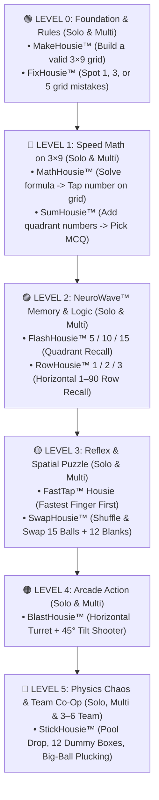

# DabHousie™ Game Brainstorming, Storyboard Catalog & Platform Roadmap

> **Document Purpose:** Living Storyboard & Product Brainstorming Document *(Discussion & Concept Design Only — Implementation executed in dedicated sprint threads).*  
> **Core Strategy:** Maximize **Single-Player (Solo) Playability** across levels to drive daily repeat visits, habit formation, and zero-host-needed retention, while supporting **Multiplayer Live** and **Playlist Sessions** for parties and events.  
> **Last Updated:** September 27, 2026

---

## Part 1: Author's Raw Brainstorming Log

### Batch 1 — Core Platform, Levels & Action/Memory Games
* **Play Modes & Core Grid:** DabHousie can become **Single Player**, **Multi Player**, and also **Team Play**, while most of them use the same **$3 \times 9$ grid canvas** and `1–90` numbers.
* **Controls:** It can be extended to **Keyboard control** and **Game Controllers** to have fully interactive games.
* **Engagement & Retention:** We have to use a **Levels and Unlock model** to keep player engagement, as retention and visiting back both need to be addressed. **The more Solo games we have, the more repeat customers and retention we get.**
* **Naming & Grouping:** List all ideas, group them properly, and sort based on filters.
* **Iterative Release:** We don't need to wait for all levels' work to be completed. We will release whatever is available and keep adding more levels. Future levels may use more manpower or AI power including graphics and animations.
* **Two-Part Dashboard Vision:**
  1. **Classic Bingo and variants** *(Luck-Based)*
  2. **DabHousie Specials** *(Skill-Based)*
* **FlashHousie-5, 10, 15 (Level-1 Interactive):** Already live. *(Once I started playing this level, I lost interest in Classic Bingo pure luck one!)*
* **RowHousie-1, 2, 3 (Level-2 Extension):** Same memory and reasoning game as FlashHousie, but instead of 3 quadrants it uses **3 horizontal rows**. Level-2 complexity is remembering 5 numbers from `1–90` spread across the 9 columns of a row. Same combinations: any single Row (`R1`, `R2`, `R3`), pairs (`R1+R2`, `R2+R3`, `R3+R1`), or all rows (`R1+R2+R3`).
* **Shuffle and Stick (`StickHousie`):** Same ticket shown to all players. Once started, all balls fall from the $3 \times 9$ grid-canvas and roll into a pool. Players drag them back to the grid and stick them. If stuck in the wrong place, after 1–2 seconds the balls fall and roll back to the pool.
  * *Team Play:* 3 to 6 players form a group (`2` fill `Q1`, `2` fill `Q2`, `2` fill `Q3`).
  * *Chaos Mechanic:* When the entry door is at the lower-ball side (top) of the quadrant, bigger balls pluck/knock smaller balls when they touch them, and both roll back to the pool.
  * *Dummy Boxes Extension:* **15 number balls + 12 dummy boxes** for all 27 cells of the $3 \times 9$ grid so top balls cannot drop accidentally without support.
  * *Easy vs. Hard:* Easy = "Stick and forget" (no slipping once placed correctly); Hard = slipping + plucking.
* **Shuffle and Swap (`SwapHousie`):** Same ticket shown to all players; when started, all balls are shuffled randomly on the grid. Players put them back in the right order by drag-and-drop (simple swap). Swapping with empty spaces is allowed, without giving clues — let players learn.
* **Fastest Finger First (`FastTap`):** Same ticket shown to all players. Controller calls a number, players click that number on their ticket. Prizes: **Fastest 5, Fastest 10, Fastest 15, Fastest House**.
* **Shooting Gun Extension (`BlastHousie`):** A shooting gun sits outside the $3 \times 9$ grid-canvas a little away. It traverses only horizontally and tilts left/right up to $45^\circ$. Player moves the gun and shoots the called ball.
  * *Chaos Mechanic:* When a **bigger number** is in the way between a **smaller number** and the gun! Player must either find an angled $45^\circ$ path through empty cells, OR wait to shoot the bigger number first when called while remembering to shoot the already-called smaller number afterward. Shooting an uncalled number does nothing. Unlimited bullets; prizes for Early-5, 4-Corners, Top/Middle/Bottom Row, Full House.

### Batch 2 — Training, Logic, Math & Playlist Session Ideas
1. **MakeHousie (Level-0 Training for Kids & Learners):** We provide the ticket rules set. The game generates 15 numbers (shown sequentially in Easy mode, and randomly in Complex mode). Player pulls them onto the $3 \times 9$ ticket grid. Every wrong attempt deducts score in Complex mode. Time taken for completion is scored.
2. **FixHousie (Spot the Mistake):** After learning the rules, a pre-filled $3 \times 9$ grid is shown to the player with intentional mistakes: duplicate/repeat numbers, vertical sequence flipped/missing, wrong column decade, numbers $> 90$, etc. The board prompts the player to **"Identify 1 mistake"**, **"Identify 3 mistakes"**, **"Identify 5 mistakes"**, etc., scoring both speed and accuracy.
3. **MathHousie (Formula-to-Grid Hunt):** A pre-filled $3 \times 9$ grid is shown to players. A math formula is displayed above the grid (e.g., grid has `70`, formula says `67 + 3 = ??`). Player must mentally calculate `70` and click `70` on the grid. 5 formulas per round; speed and accuracy scored. Supports `+`, `-`, `×`, `÷` variations.
4. **SumHousie (Quadrant Rapid Addition):** Quadrant-based addition game. Player is shown only **one quadrant** (`Q1`, `Q2`, or `Q3`). Countdown starts. Player adds all numbers in that quadrant and picks the correct total from **3 or 4 multiple-choice buttons** (no typing). In Solo mode, time & accuracy are scored; in Multiplayer, it is Fastest Finger First.
5. **Host Game Playlist (Continuous Multi-Game Session):** Host can build a **playlist of games** that play one after another automatically so all multiplayer guests remain in the **exact same session/room**. Each mini-game takes `3–4 minutes`, allowing the host to curate a `15-minute`, `20-minute`, or `60-minute` continuous party experience.

---

## Part 2: Master Game Catalog — Solo vs. Multiplayer & Level Grouping

Since **Solo Playability = Daily Retention & Repeat Visits**, every skill game below is evaluated for **👤 Solo Mode** first, plus **👥 Multiplayer Live** and **🤝 Team Play**.

> **Key Insight:** **10 out of 10 Skill Games** can be played **100% Solo**! Only *Classic 90-Ball Bingo* requires a live caller/group to be fun; every single *DabHousie™ Special* works as an instant Single-Player game AND as a Multiplayer / Playlist game.

| Level Tier | Game Name | Category / Brain Skill | 👤 Solo Mode? | 👥 Multi / 🤝 Team? | Target Audience | Est. Complexity |
| :--- | :--- | :--- | :---: | :---: | :--- | :--- |
| **Level 0A** | **MakeHousie™** | 🎓 **Rule Builder & Sorting** | ✅ **YES (Core Solo)** | ✅ Multi Race | Kids, Beginners, First-time Visitors | 🟢 **Very Easy** |
| **Level 0B** | **FixHousie™** | 🔍 **Error Detection & Audit** | ✅ **YES (Core Solo)** | ✅ Multi Race | Kids, Puzzle Lovers, Daily Brain Warmup | 🟢 **Very Easy** |
| **Level 1A** | **MathHousie™** | ➕ **Mental Math + Column Hunt** | ✅ **YES (Core Solo)** | ✅ Multi Race | Students, Families, Speed-Math Fans | 🟢 **Very Easy** |
| **Level 1B** | **SumHousie™** | 🧮 **Quadrant Addition (MCQ)** | ✅ **YES (Core Solo)** | ✅ Fastest Finger | Quick Thinkers, Party Icebreakers | 🟢 **Very Easy** |
| **Level 2A** | **FlashHousie™ 5/10/15** | 🧠 **Quadrant Memory & Logic** | ✅ **YES (Add Solo!)** | ✅ **LIVE NOW** | All Skill Players, Competitive Groups | ✅ **Built** *(Add Solo)* |
| **Level 2B** | **RowHousie™ 1/2/3** | 🧠 **1–90 Horizontal Row Memory** | ✅ **YES (Core Solo)** | ✅ Multi Live | Advanced Memory & Deductive Players | 🟢 **Very Easy** |
| **Level 3A** | **FastTap™ Housie** | ⚡ **Pure Reflex & Speed** | ✅ **YES (Time Trial)** | ✅ Fastest Finger | High-Energy Party Groups & Casual Solo | 🟢 **Very Easy** |
| **Level 3B** | **SwapHousie™** | 🧩 **Spatial Swap & Logic** | ✅ **YES (Core Solo)** | ✅ Multi Race | Sudoku / Wordle / Logic Puzzle Fans | 🟡 **Easy-Medium** |
| **Level 4** | **BlastHousie™** | 🎯 **45° Arcade Turret Shooter** | ✅ **YES (Core Solo)** | ✅ Multi Arcade | Gamers, Teens, Keyboard/Gamepad Users | 🟡 **Medium** |
| **Level 5** | **StickHousie™** | 🏗️ **Gravity, Dummy Boxes & Chaos** | ✅ **YES (Core Solo)** | ✅ Multi + **🤝 3–6 Team** | Hardcore Skill & Co-Op Team Players | 🟠 **Medium-High** |
| *Classic* | **Classic 90-Ball** | 🎲 **Pure Luck Social Bingo** | ❌ *(Group Only)* | ✅ **LIVE NOW** | Traditional Kitty Parties & Galas | ✅ **Built** |

---

## Part 3: Antigravity Storyboard Comments & Design Refinements (Batch 2)

### 1. `MakeHousie™` (Level 0A — Ticket Builder & Rule Trainer)
* **Why This Is Essential:**
  * Every advanced game on our platform (`FlashHousie`, `RowHousie`, `SwapHousie`, `BlastHousie`, `FixHousie`) becomes 10x more fun once a player knows the **3 Golden Rules of a $3 \times 9$ Ticket**:
    1. **Column Decade Rule:** `Col 1 = 1–9`, `Col 2 = 10–19`, ..., `Col 9 = 80–90`.
    2. **Vertical Ascending Rule:** Inside any column, smaller numbers always sit above larger numbers.
    3. **Row & Column Quota Rule:** Exactly `5 numbers per row` (`15` total) and `1 to 3 numbers per column`.
  * **MakeHousie™** turns learning these rules into a fun **Level-0 game** for kids and newcomers!
* **Gameplay Refinement:**
  * **Easy Mode (Guided Sequential):** The 15 numbers are shown in sorted order (`5, 14, 22, 29...`). Column headers (`1–9`, `10–19`) and row counters (`Row 1: 2/5`) are visible to guide placement.
  * **Complex Mode (Unassisted Random):** The 15 numbers are dealt in a **shuffled pool**. Column headers are hidden. If a player drops `34` into Column 3, or places `28` above `21`, or puts a 6th number in Row 1, it flashes red and deducts `-3 points`.
  * **💡 Design Detail:** What if a valid set of 15 numbers has two numbers in Column 2 (`12` and `18`), and in Complex mode the player drags `18` into `Row 1, Col 2` before noticing `12` is also in the pool?
    * **Solution:** Show all 15 numbers in the bottom pool simultaneously so the player must **scan the pool first** before choosing whether `18` belongs in `Row 1`, `Row 2`, or `Row 3`! That teaches genuine look-ahead planning.

---

### 2. `FixHousie™` (Level 0B — "Spot the Bug" Ticket Inspector)
* **Why This Is Addictive (Solo & Multiplayer):**
  * People love "Spot the Mistake" puzzles! A round takes only **15 to 30 seconds**, making it an incredible daily warmup or rapid playlist round.
* **Catalog of Intentional Mistakes the Engine Can Generate:**
  1. **Decade Trespasser:** e.g., `45` sitting inside Column 4 (`30–39`).
  2. **Gravity Inversion (Sequence Error):** e.g., `67` in Row 1 and `62` below it in Row 2 of Column 7.
  3. **Twin Clone (Duplicate Number):** e.g., `19` appearing twice in Column 2 (or in two adjacent columns).
  4. **Impossible Ball (`> 90` or `0`):** e.g., `94` or `00` sneaking into Column 9 or Column 1.
  5. **Row Overload / Starvation (Hard Mode):** Row 1 has `6 numbers` while Row 3 has only `4 numbers`, or a column is completely empty (`0 numbers`)!
* **Progression Sub-Levels:**
  * *Rookie Inspector:* Find **1 Mistake** (with mistake category hint shown).
  * *Senior Inspector:* Find **3 Mistakes** (no hints).
  * *Master Auditor:* Find **5 Mistakes** in under 20 seconds (wrong taps deduct score!).

---

### 3. `MathHousie™` (Level 1A — Formula-to-Grid Mental Math)
* **Why This Works So Well on a $3 \times 9$ Grid:**
  * In normal math games, players just type a number or click 1 of 4 buttons.
  * In **MathHousie™**, the $3 \times 9$ ticket **IS the answer pad**!
  * When the formula says `67 + 3 = ??`, the player:
    1. Calculates `70` mentally,
    2. Uses the $3 \times 9$ column rule to jump straight to **Column 8 (`70–79`)**, and
    3. Clicks `70`!
  * **Smart Formula Generator:** The game engine picks 5 target numbers that *actually exist* on the current $3 \times 9$ ticket (e.g., `70`, `14`, `56`, `81`, `29`) and dynamically generates arithmetic formulas that evaluate to those exact ticket numbers:
    * **Level 1 (`+` / `-`):** `67 + 3`, `90 - 19`, `48 + 8`
    * **Level 2 (`×` / `÷`):** `14 × 5` (`= 70`), `84 ÷ 6` (`= 14`), `9 × 9` (`= 81`)
    * **Level 3 (Mixed Bodmas / Two-Step):** `(8 × 9) - 2` (`= 70`)
* **Kids & Schools Angle:** This makes DabHousie immediately appealing to **parents, kids, and teachers** as a fun STEM / mental-math brain trainer!

---

### 4. `SumHousie™` (Level 1B — Quadrant Rapid Addition MCQ)
* **Gameplay Flow:**
  * Only one $3 \times 3$ quadrant (`Q1`, `Q2`, or `Q3`) is shown on the board (5 numbers).
  * A countdown clock ticks down (e.g., `15 seconds`).
  * Below the grid are **4 big Multiple-Choice buttons (`A`, `B`, `C`, `D`)** — zero typing required.
* **💡 Crucial Anti-Shortcut Design Rule (Same Last-Digit Decoys):**
  * Suppose the 5 numbers in `Q1` are `3, 8, 12, 19, 24`. Their sum is `66`.
  * If the 4 choices are `52`, `66`, `74`, `89`, a clever player won't add the tens at all — they will just add the last digits (`3 + 8 + 2 + 9 + 4 = 26` $\rightarrow$ ends in `6`) and click `66` in 2 seconds!
  * **Our Fix:** Generate decoy choices that **share the same last digit** (or are $\pm 1$, $\pm 10$ off):
    * e.g., Choices: **`[ 56 ]`  `[ 66 ]`  `[ 76 ]`  `[ 64 ]`**!
    * Now the player must genuinely add both the tens and units!
* **Natural Difficulty Curve by Quadrant:**
  * **Round 1 (`Q1: 1–29`):** Small numbers $\rightarrow$ Fast mental sum (Easy).
  * **Round 2 (`Q2: 30–59`):** Medium numbers $\rightarrow$ Moderate mental sum (Medium).
  * **Round 3 (`Q3: 60–90`):** Large numbers $\rightarrow$ High mental sum (Hard).

---

### 5. Host Game Playlist ("Party Marathon / Continuous Session Mode")
* **Why This Is a Must-Have Multiplier for Hosts:**
  * Classic 90-Ball Bingo takes `15–20 minutes` for a single game, whereas our skill games (`FixHousie`, `MathHousie`, `SumHousie`, `FlashHousie`, `RowHousie`, `FastTap`) are high-intensity **3-to-4 minute rounds**.
  * With **Playlist Mode**, a Host can create **one single event room** (one Invite Code, one Seat OTP list) and queue up a custom playlist for **15, 30, or 60 minutes**!
* **How the Playlist Storyboard Works:**
  1. **Host Playlist Builder (in Create Game):**
     * Host selects **"Playlist / Marathon Mode"** or chooses a target duration (`15 min` / `30 min` / `60 min`).
     * Host picks a sequence of mini-games (or chooses a 1-click preset):
       * *Preset 1 — Family & Kids Fun (20 mins):* `MakeHousie` $\rightarrow$ `FixHousie` $\rightarrow$ `MathHousie` $\rightarrow$ `SumHousie` $\rightarrow$ `FastTap`
       * *Preset 2 — Brain & Speed Challenge (20 mins):* `FixHousie` $\rightarrow$ `SumHousie` $\rightarrow$ `FlashHousie 5` $\rightarrow$ `RowHousie 1` $\rightarrow$ `FastTap`
       * *Preset 3 — Ultimate Party Mix (45 mins):* 5 Skill Mini-Games (`3 mins` each) + Classic 90-Ball Grand Finale (`20 mins`).
  2. **Seamless Room Continuity:**
     * Players join **once**. They never leave the screen between games.
     * Between each 3–4 minute game, a **15-second Intermission & Mini-Podium** displays the winner of that mini-game and previews the rules of the next mini-game in the queue.
  3. **Dual Leaderboard (Mini-Game Prizes + Overall Playlist Champion):**
     * Every mini-game awards points (`1st = 100 pts`, `2nd = 75 pts`, `3rd = 50 pts`, + participation/accuracy score) toward the **Session Grand Leaderboard**, crowning an overall **Grand Champion** at the end of the 15/30/60-minute playlist!

---

## Part 4: Updated Progression Tree (Level 0 $\rightarrow$ Level 5)

With your new ideas, our **Level & Unlock Progression** now has a complete, natural staircase from **5-year-old beginners** all the way to **hardcore skill & co-op teams**:

---

## Part 5: Discussion Notes & Next Brainstorming Prompts

1. **Every Skill Game is Now Solo-First:**
   * All 10 skill variants (`MakeHousie`, `FixHousie`, `MathHousie`, `SumHousie`, `FlashHousie`, `RowHousie`, `FastTap`, `SwapHousie`, `BlastHousie`, `StickHousie`) can be played **Solo** with zero host required.
   * A visitor can start at **Level 0 (`MakeHousie` / `FixHousie`)** on Day 1, unlock **Level 1 (`MathHousie` / `SumHousie`)**, then **Level 2 (`FlashHousie` / `RowHousie`)**, and keep coming back to beat their time and unlock higher levels!
2. **Playlist Mode Monetization / Credit Fit:**
   * For hosts, a **Playlist Session** is also a great value proposition: instead of paying credits per 3-minute mini-game, a host books a **Session Room** (by player capacity tier, e.g., Free for 1–5 players, or Paid for 6–250 players) and can chain up to `N` mini-games inside that single event!
3. **Open for More Ideas:**
   * Whenever you have more single-line storyboards or tweaks to these rules, share them here and we will keep expanding and refining [gameBrainStorming.md](file:///C:/dev/Tambola/docs/gameBrainStorming.md)!
