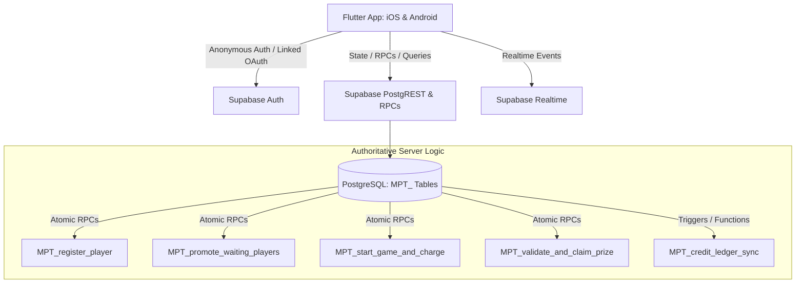
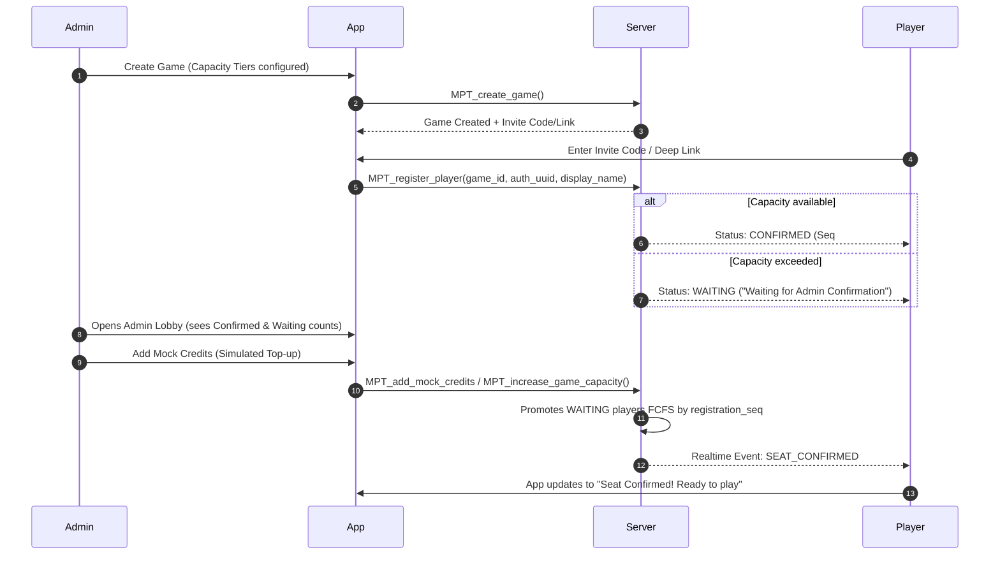

# Implementation Plan: Multiplayer Tambola Mobile App (Flutter / Android & iOS)

A comprehensive architectural and delivery plan for building the cross-platform Multiplayer Tambola mobile application adhering to the consolidated specifications (Master README v1.2, Document 9 Auth & Identity, Additional Frozen Instructions v1.1, and Documents 4–8).

---

## 1. Repository & Environment Inspection

- **Current Repository State**: Clean workspace containing only the `docs/` directory. No Flutter project or database files exist yet.
- **Toolchain**:
  - **Flutter SDK**: 3.38.5 (Channel stable)
  - **Dart SDK**: 3.10.4
  - **Platform Targets**: Android & iOS (plus web/browser-ready live display)
  - **Backend Target**: Existing Supabase project (Free plan, sharing PostgreSQL instance with strict `MPT_` namespace isolation for tables, RPCs, views, and RLS policies).

---

## 2. Core Architecture & Frozen Decisions Alignment



### Key Frozen Principles
1. **Single App, Dual Role**: Any user can be a Player in one game and an Admin in another.
2. **Anonymous-First Player Identity**: Authoritative player key is the Supabase Auth UUID (never device ID). Players require no email or phone. Players select a display name and avatar.
3. **Optional Account Protection**: Players can link Google/Apple ID to safeguard tickets, history, and rewards against app deletion/reinstall.
4. **Admin Financial Identity**: Admins must link a persistent identity (Google/Apple) and provide an Admin email for receipts before purchasing credits or managing funded games.
5. **No Mobile E-Commerce**: No in-app credit checkout (to comply with platform store guidelines). Configurable external web handoff with trusted backend webhook confirmation.
6. **Strict Database Namespace**: All tables, views, functions, triggers, and policies MUST start with `MPT_` (e.g. `MPT_games`, `MPT_game_registrations`, `MPT_player_tickets`, `MPT_admin_wallets`, `MPT_credit_transactions`, `MPT_capacity_tiers`, `MPT_rewards`, `MPT_claims`, `MPT_called_numbers`, `MPT_notifications`, `MPT_admin_profiles`).
7. **Server-Authoritative Game State**: Clients never finalize capacity, credit charges, ticket validation, or winner declarations. All transitions use ACID transactions / RPCs with idempotency keys.

---

## 3. Implementation Roadmap & Vertical Slice Strategy

### Mandatory First Vertical Slice (Sprints 0, 1, 2, 3)
> [!IMPORTANT]
> Per the specification, we will build and verify the core registration, capacity overflow, mock wallet, and automatic promotion loop before implementing the full Tambola number calling engine.



---

## 4. Phase-by-Phase Breakdown

### Phase 1: Foundation & Setup (Sprint 0)
- **Flutter Initialization**: Create Flutter project configured for Android, iOS, and Web.
- **State Management & Architecture**: Feature-first architecture using `flutter_riverpod` (or `bloc`), `go_router`, and Supabase Flutter SDK.
- **Theme & Design System**: Responsive, accessible UI tokens supporting mobile portrait and tablet/browser landscape views.
- **Supabase Migrations**: Initial SQL schema definitions with `MPT_` tables, constraints, RLS policies, and core helper functions.

### Phase 2: Authentication & Profile (Sprint 1)
- **Anonymous Authentication**: Automatic session initiation on first launch.
- **Player Profile Setup**: Local/Remote storage for Display Name + Avatar picker.
- **Account Linking Service**: Google & Apple Sign-in integration hooks preserving existing Auth UUID.
- **Admin Profile & Protected Mode**: Enforcing linked account & email entry prior to wallet actions.

### Phase 3: Game Creation, Invitations & Registration Queue (Sprint 2)
- **Game Creation**: Admin screen with name, schedule, rules, capacity tier preview.
- **Invite Code & Deep Link Generator**: Short alphanumeric code + URL handler.
- **Player Registration Flow**: Server-side registration sequence generator with atomic `CONFIRMED` / `WAITING` assignment.
- **Registration State UI**: Distinct, unambiguous UI for "Seat Confirmed" vs "Waiting for Admin Confirmation".

### Phase 4: Admin Lobby, Mock Wallet & Automatic Promotion (Sprint 3)
- **Admin Lobby**: Live dashboard showing registered, confirmed, and waiting counts.
- **Mock Credit Wallet & Web Handoff Placeholder**: Ledger-backed wallet display with configurable mock credit injection for testing.
- **Capacity Promotion Engine**: Server RPC promoting `WAITING` users in registration sequence order and emitting `SEAT_CONFIRMED` events.
- **In-App Realtime Notification Listener**: Live seat update handling on the player device.

### Phase 5: Game Start & Authoritative Tambola Engine (Sprints 4, 5, 6)
- **Atomic Game Start**: Deduct credits from wallet, record `MPT_game_charges`, lock game capacity, promote `CONFIRMED` to `ELIGIBLE`, freeze unconfirmed to `NOT_ELIGIBLE`.
- **Tambola Ticket Generator**: Deterministic, validated 3x9 grid generator (5 numbers per row, strictly sorted columns 1–90).
- **Authoritative Number Caller**: Server-side board caller (manual or automated timer), broadcasting `NUMBER_CALLED` events.
- **Claim & Winner Validation**: Instant server-side validation against called numbers (Early 5, Top Line, Middle Line, Bottom Line, Full House, etc.) with race-condition handling.
- **Rewards System**: Generating unique verification references in `MPT_rewards` for in-app verification.

### Phase 6: Live Display, Configurable Web Payments & Hardening (Sprints 7, 8, 9)
- **Live Display Screen**: Projector-friendly responsive web/app view showing called board, current number, and winner announcements.
- **Web Purchase Handoff**: Server-configurable checkout redirection and webhook handler for credit reconciliation.
- **Reliability & Disconnect Recovery**: Automatic state snapshot reconciliation on network reconnect.

---

## 5. Proposed Project Structure

```
Tambola/
├── docs/                                  # Frozen specs and design documentation
├── supabase/
│   └── migrations/
│       ├── 20260901000001_mpt_core_schema.sql
│       ├── 20260901000002_mpt_registration_promotion_rpc.sql
│       └── 20260901000003_mpt_game_engine_rpc.sql
├── lib/
│   ├── main.dart
│   ├── app/
│   │   ├── config/ (environment, remote config, theme)
│   │   ├── routes/ (go_router routes)
│   │   └── theme/
│   ├── core/
│   │   ├── constants/
│   │   ├── network/ (supabase client, api endpoints)
│   │   └── utils/ (ticket generator algorithms, formatting)
│   ├── features/
│   │   ├── auth/ (anonymous auth, display name, avatar, account linking)
│   │   ├── game_setup/ (create game, invite sharing, capacity tiers)
│   │   ├── registration/ (join game, waiting status, seat confirmed)
│   │   ├── admin_lobby/ (lobby dashboard, capacity warnings, start game)
│   │   ├── wallet/ (credits, ledger, web payment handoff, mock credits)
│   │   ├── gameplay/ (ticket view, number caller, live board, claims)
│   │   ├── rewards/ (player rewards list, admin reward verification)
│   │   └── live_display/ (projector/browser big screen view)
│   └── shared/
│       ├── models/
│       └── widgets/
└── test/
    ├── unit/
    └── widget/
```

---

## 6. Open Questions & Technical Clarifications

> [!NOTE]
> Please review the following points and provide your input or preferences before we begin writing code.

1. **Supabase Environment**:
   - Do you already have a Supabase project URL and anon/service keys configured for this app, or would you like us to set up local Supabase CLI configuration and SQL migrations first for local development and testing?
2. **State Management Preference**:
   - We recommend **Riverpod (with code generation / hooks)** for robust testability, immutability, and seamless Supabase Realtime stream bindings. Does this align with your tech stack preference?
3. **Third-Party Auth Credentials**:
   - For Google and Apple account linking, do you have OAuth client IDs configured in Supabase, or should we structure the auth layer to allow testing anonymous authentication first while keeping OAuth provider hooks configurable?
4. **Ticket Rules & Prize Configuration**:
   - Are there specific initial winning patterns you want supported in MVP besides the standard: **Early 5 (Jaldi 5)**, **Top Line**, **Middle Line**, **Bottom Line**, **Four Corners**, and **Full House (First & Second)**?
